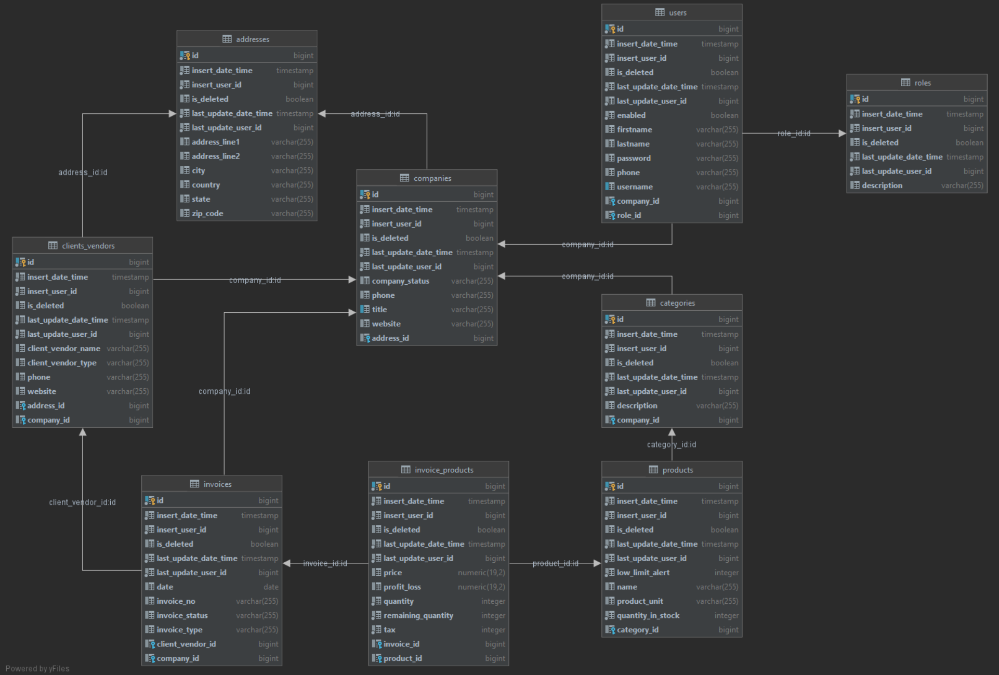

****ACCOUNTING PROJECT****

**Overview**

Welcome to the Accounting Project repository! This project represents a comprehensive demonstration of a feature-rich application developed using cutting-edge technologies. It encompasses the seamless integration of third-party APIs, the creation of custom annotations, and the effective use of Thymeleaf, Spring Boot, Spring MVC, and Spring Security.

**Key Technologies Used:**

*-Spring Boot Microservices:*
The project is built using the Spring Boot framework, embracing the principles of microservices architecture for modularity and scalability.

*-Spring MVC and Thymeleaf:* Spring MVC is employed for server-side rendering, delivering dynamic content seamlessly integrated with Thymeleaf for frontend development.

*-Spring Cloud and Feign Client:* Spring Cloud facilitates the creation and management of microservices, while the Feign Client simplifies the integration of 3rd party APIs, ensuring efficient communication between applications.

*-Spring Data:* Spring Data is utilized for simplified data access and management, providing a consistent and streamlined approach to working with databases.

*-Validation:* Robust validation mechanisms are implemented to ensure data integrity and enhance the overall reliability of the application.

*-PostgreSQL:* The relational database management system PostgreSQL is chosen for efficient storage and management of structured data.

*-Unit Testing & Integration Testing:* The application is rigorously tested with comprehensive unit and integration tests, ensuring its reliability and robustness.

*-Keycloak:* Integrated Keycloak for authentication and authorization, ensuring the security of microservices.

*-Dockerization:* The entire application is containerized using Docker, offering a consistent and portable environment for deployment across various scenarios.

